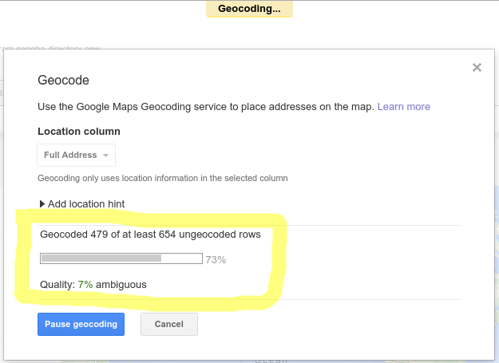

***Now we need to wait for a short while***


***Here there is a very long wait. It's possible that the process will stop due to some error. If you wish to continue in spite of this you need to press to resume***




## Embed code
```
<iframe width="800" height="500" scrolling="no" frameborder="no" src="https://www.google.com/fusiontables/embedviz?q=select+col16+from+1ykUrUnOcLxmBk4n_5QgQRsE-TPxHsWHfEnG86lNX&amp;viz=MAP&amp;h=false&amp;lat=41.75777902412412&amp;lng=-40.89296060976564&amp;t=1&amp;z=3&amp;l=col16&amp;y=2&amp;tmplt=4&amp;hml=GEOCODABLE"></iframe>
```

### Some parameters to note

#### ```width``` and ```height```
These determine the size of the frame

#### ```lat``` and ```lng```
These determine where the focus of the map is. Is automatically set when clicking on "tools" -> "publish" using the focus on the map in the background

#### ```z``` (zoom level)
Is automatically set when clicking on "tools" -> "publish" using the zoom level of the map in the background


